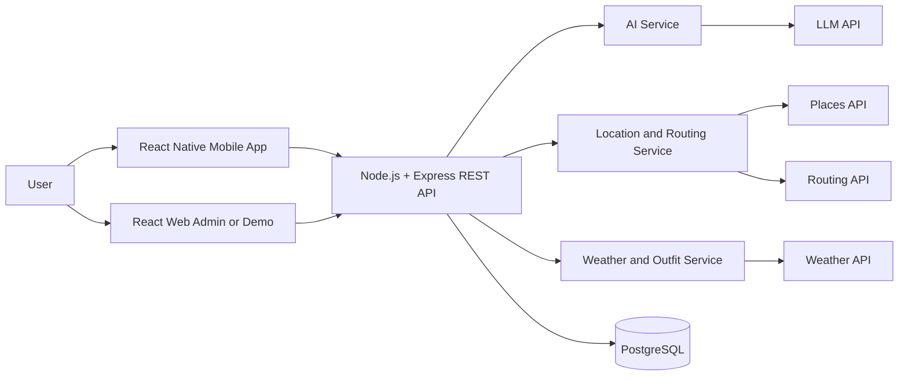
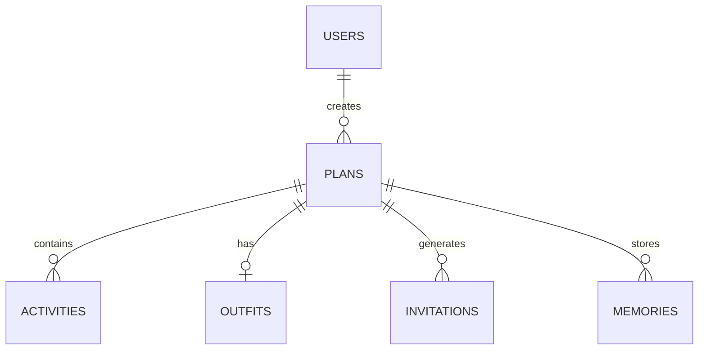
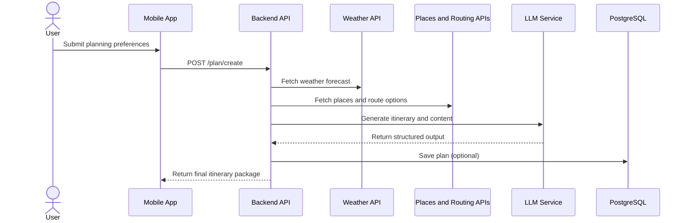

# Anong Ganap? Documentation

## 1. Executive Summary
Anong Ganap? is an AI-powered activity planner that creates complete, personalized itineraries for dates, hangouts, family outings, and solo trips.

The platform reduces planning friction by combining the following in one app:

- itinerary generation
- place recommendations
- transportation guidance
- weather-aware adjustments
- outfit suggestions
- invitation generation
- plan and memory storage

## 2. Problem Statement
Users often plan activities across multiple disconnected apps. A single plan can require separate tools for maps, places, weather, budgeting, messaging, and inspiration. This causes:

- decision fatigue
- inconsistent planning quality
- higher planning time
- missed details such as weather conflicts or budget overrun

## 3. Proposed Solution
Anong Ganap? offers one flow where users provide key inputs, and the system returns an actionable and shareable plan.

### Input
- location
- budget
- activity type
- date and available time
- transportation preference
- mood or theme

### Output
- sequenced itinerary with timestamps
- recommended places with estimated costs
- route guidance and travel estimates
- weather-aware activity and outfit adjustments
- invitation text (and optional send flow)

## 4. Project Objectives

### General Objective
Build an AI-assisted planning system that generates complete, practical, and personalized activity plans.

### Specific Objectives
1. Generate itinerary drafts in under 10 seconds for standard requests.
2. Keep total suggested cost within user budget tolerance.
3. Provide route options with time and fare estimates.
4. Produce weather-appropriate outfit suggestions.
5. Generate customizable invitation content.
6. Persist plan history for retrieval and reuse.

## 5. Target Users And Primary Use Cases

| User Segment | Main Need | Example Outcome |
| --- | --- | --- |
| Couples | Romantic date planning | Sunset date plan with matching outfits and invitation |
| Friends | Group hangout coordination | Multi-stop plan with shared schedule |
| Families | Easy outing logistics | Family-friendly route and activity sequence |
| Tourists | Local discovery | Nearby attractions with commute guidance |
| Solo users | Personal exploration | Budget-based leisure itinerary |

## 6. MVP Scope

### In Scope
- user input collection
- AI itinerary generation
- nearby place recommendation
- route and travel estimate retrieval
- weather retrieval and adjustment logic
- outfit recommendation generation
- invitation generation
- plan persistence in database

### Out Of Scope (MVP)
- in-app payments
- booking integrations (restaurant or transport reservations)
- advanced social feeds
- fully offline navigation
- enterprise multi-tenant features

## 7. Functional Requirements

### 7.1 Itinerary Generator
- The system shall generate a timeline based on user inputs and contextual data.
- The system shall provide estimated cost per activity and total estimated cost.
- The system shall include fallback activities when weather changes are detected.

### 7.2 Place Recommendation
- The system shall fetch nearby places by category and relevance.
- The system shall filter recommendations by budget compatibility when available.
- The system shall return coordinates for mapping and routing.

### 7.3 Transportation Guidance
- The system shall return route options with estimated duration and cost.
- The system shall support common commute modes and ride-hailing assumptions.

### 7.4 Outfit Suggestion
- The system shall suggest coordinated outfits based on activity context and weather.
- The system shall include weather-specific add-ons (for example umbrella or jacket).

### 7.5 Invitation Generator
- The system shall produce invitation-ready text from finalized plans.
- The system shall support editable content before sharing or sending.

### 7.6 Plan Storage
- The system shall store created plans and related entities for later retrieval.
- The system shall support read access to previously generated plans.

## 8. Non-Functional Requirements

### Performance
- Plan generation target: less than 10 seconds for normal traffic.
- API p95 target: less than 1.5 seconds for non-AI endpoints.

### Reliability
- Graceful fallback when one external provider fails.
- Retry policy with capped exponential backoff for transient API errors.

### Security
- Authenticated access for user-owned plans.
- Encryption in transit for all external API calls.
- Secret management through environment variables.

### Privacy
- Store only necessary user data.
- Explicit consent for storing photos and memories.

### Maintainability
- Layered architecture with service boundaries.
- Clear API contracts and validation schemas.

## 9. System Architecture

```text
[React Native Mobile App]     [React Web Admin/Demo]
             \                        /
              \------ REST API -------/
                          |
                 [Node.js + Express]
                          |
         +----------------+----------------+
         |                |                |
    [AI Service]    [Location Service] [Weather/Outfit Service]
         |                |                |
   OpenAI/LLM API   Places + Routing APIs  Weather API
                          |
                    [PostgreSQL Database]
```

### Mermaid: High-Level Architecture


### Layer Responsibilities
- Presentation layer: mobile and web interfaces, form inputs, and result views.
- Application layer: orchestration, validation, rule handling, and API integration.
- Data layer: persistence for users, plans, activities, outfits, invitations, memories.

## 10. Data Model

### Core Entities
- users
- plans
- activities
- outfits
- invitations
- memories

### Mermaid: Entity Relationship Overview


### Suggested Schema (MVP)
```sql
CREATE TABLE users (
  id SERIAL PRIMARY KEY,
  name VARCHAR(120) NOT NULL,
  email VARCHAR(255) UNIQUE NOT NULL,
  password_hash TEXT NOT NULL,
  created_at TIMESTAMP NOT NULL DEFAULT NOW()
);

CREATE TABLE plans (
  id SERIAL PRIMARY KEY,
  user_id INT NOT NULL REFERENCES users(id),
  title VARCHAR(180),
  location VARCHAR(255) NOT NULL,
  budget NUMERIC(10,2) NOT NULL,
  theme VARCHAR(100),
  date_created TIMESTAMP NOT NULL DEFAULT NOW(),
  weather_summary VARCHAR(255)
);

CREATE TABLE activities (
  id SERIAL PRIMARY KEY,
  plan_id INT NOT NULL REFERENCES plans(id) ON DELETE CASCADE,
  activity_name VARCHAR(180) NOT NULL,
  place_name VARCHAR(180),
  latitude NUMERIC(10,7),
  longitude NUMERIC(10,7),
  start_time TIMESTAMP,
  estimated_cost NUMERIC(10,2),
  is_indoor BOOLEAN
);

CREATE TABLE outfits (
  id SERIAL PRIMARY KEY,
  plan_id INT NOT NULL REFERENCES plans(id) ON DELETE CASCADE,
  theme VARCHAR(120),
  person_a_outfit TEXT,
  person_b_outfit TEXT,
  weather_adjusted BOOLEAN NOT NULL DEFAULT TRUE
);

CREATE TABLE invitations (
  id SERIAL PRIMARY KEY,
  plan_id INT NOT NULL REFERENCES plans(id) ON DELETE CASCADE,
  receiver_email VARCHAR(255),
  invitation_message TEXT NOT NULL,
  sent_status VARCHAR(30) NOT NULL DEFAULT 'draft'
);

CREATE TABLE memories (
  id SERIAL PRIMARY KEY,
  plan_id INT NOT NULL REFERENCES plans(id) ON DELETE CASCADE,
  photo_url TEXT,
  note TEXT,
  created_at TIMESTAMP NOT NULL DEFAULT NOW()
);
```

## 11. API Design (MVP)

| Method | Endpoint | Purpose |
| --- | --- | --- |
| POST | /plan/create | Generate itinerary and optionally store plan |
| GET | /plan/:id | Retrieve one saved plan |
| POST | /outfit/generate | Generate weather-aware coordinated outfit |
| GET | /weather/:lat/:lon | Retrieve weather forecast snapshot |
| GET | /places/nearby | Retrieve place suggestions |
| GET | /routes | Retrieve route options and estimates |
| POST | /invitation/create | Generate invitation content |
| POST | /send-invitation | Send invitation via email provider |

## 12. AI Workflow
1. Validate user input and normalize units.
2. Gather context (weather, places, routing).
3. Build constrained prompt with budget/time guardrails.
4. Generate candidate itinerary.
5. Apply rule-based checks (budget overrun, schedule conflicts, weather mismatch).
6. Generate outfit and invitation outputs.
7. Return final plan and persist if requested.

### Mermaid: Plan Generation Sequence


## 13. UI Structure

### Mobile Screens
1. Home
2. Plan setup
3. Generated itinerary
4. Outfit suggestion
5. Invitation preview/send
6. Plan summary

### Web Admin/Demo (Optional)
- generated plan inspection
- saved plan review
- basic usage metrics

## 14. Testing Strategy

### Unit Tests
- itinerary formatting and validation logic
- budget and weather rule checks
- API response mappers

### Integration Tests
- backend to external API adapters
- persistence and retrieval flows

### End-To-End Tests
- create plan to invitation send flow
- weather-triggered indoor fallback flow

## 15. Deployment And Operations

### Hosting
- frontend: Vercel
- backend: Render
- database: Supabase PostgreSQL

### CI/CD
- GitHub Actions pipeline:
  - lint
  - test
  - build
  - deploy (protected main branch)

### Observability
- error tracking (Sentry)
- basic analytics (event tracking)
- API logs for failure triage

## 16. Risks And Mitigations

| Risk | Impact | Mitigation |
| --- | --- | --- |
| External API quota limits | Plan generation failure | Caching, retries, provider fallback |
| Weather forecast inaccuracies | Lower trust in recommendations | Show confidence and update reminders |
| Cost estimate mismatch | User dissatisfaction | Display estimate ranges and disclaimers |
| Prompt inconsistency | Unstable output quality | Prompt templates with strict output schema |

## 17. Success Metrics (MVP)
- plan completion rate
- average plan generation time
- user edit rate before finalizing
- invitation send rate
- repeat usage over 30 days

## 18. Future Enhancements
- real-time weather alerts and rerouting
- social planning with voting and collaboration
- offline map and itinerary access
- recommendation learning from prior plans
- local booking and payment integration
